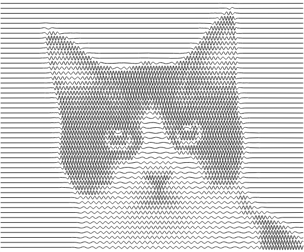

# image-stylization-sines

## Description
This is a simple tool to turn images into a series of sine waves of varying frequency and amplitude.

See it live [here](https://piellardj.github.io/image-stylization-sines).

